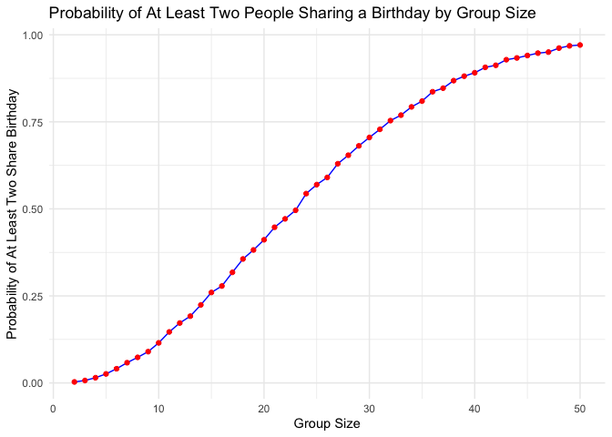
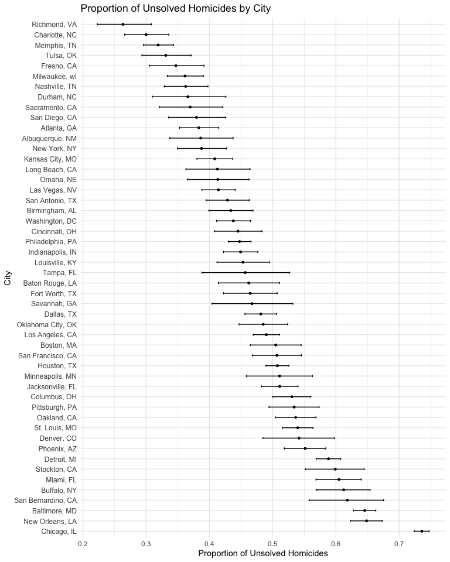

p8105_hw5_yx2954
================
Yiran Xu
2024-11-09

``` r
library(ggplot2)
library(tidyverse)
```

    ## ── Attaching core tidyverse packages ──────────────────────── tidyverse 2.0.0 ──
    ## ✔ dplyr     1.1.4     ✔ readr     2.1.5
    ## ✔ forcats   1.0.0     ✔ stringr   1.5.1
    ## ✔ lubridate 1.9.3     ✔ tibble    3.2.1
    ## ✔ purrr     1.0.2     ✔ tidyr     1.3.1
    ## ── Conflicts ────────────────────────────────────────── tidyverse_conflicts() ──
    ## ✖ dplyr::filter() masks stats::filter()
    ## ✖ dplyr::lag()    masks stats::lag()
    ## ℹ Use the conflicted package (<http://conflicted.r-lib.org/>) to force all conflicts to become errors

``` r
library(knitr)
```

# Problem 1

## Make function

``` r
check_duplicate_birthdays = function(n) {
  if ((as.integer(n) <= 0) == TRUE) {
    stop("Argument n should be positive integer")
  }
  birthdays = sample(1:365, n, replace = TRUE)
  return(length(birthdays) != length(unique(birthdays)))
  }
```

## Simulation run

``` r
run_times = 10000
n_range = 2:50
prob = numeric(length(n_range))
```

``` r
for (n in n_range) {
  duplicates = sum(replicate(run_times, check_duplicate_birthdays(n)))
  prob[n - 1] = duplicates / run_times
}
```

## Make plot

``` r
results = data.frame(GroupSize = n_range, Probability = prob)

ggplot(results, aes(x = n_range, y = prob)) +
  geom_line(color = "blue") +
  geom_point(color = "red") +
  labs(title = "Probability of At Least Two People Sharing a Birthday by Group Size",
       x = "Group Size", y = "Probability of At Least Two Share Birthday") +
  theme_minimal()
```

<!-- -->

The plot shows that the probability of at lease two people share
birthdays increases as group size grows. It reaches 0.5 as group size is
23 and is approaching 1.0 near 50 people. The slope decreases as the
group size gets larger, indicating a slower probability increase at
higher group sizes.

# Problem 2

## Build function

``` r
simulate_test = function(mu, n = 30, sigma = 5, simulations = 5000, alpha = 0.05) {
  if (as.integer(mu) != mu) {
    stop("Argument mu should be integer")
  }
  
  test_output = vector("list", length = simulations)
  
  for (i in 1:simulations) {
    data = rnorm(n, mean = mu, sd = sigma)
  
    test_result = t.test(data, mu = 0)
    
    test_output[[i]] = broom::tidy(test_result) |>
      select(estimate, p.value)
  }
  
  output_df = bind_rows(test_output)
  
  power = mean(output_df$p.value < alpha)
  
  avg_estimate_all = mean(output_df$estimate)
  
  avg_estimate_rejected = mean(output_df$estimate[output_df$p.value < alpha], na.rm = TRUE)
  
  return(tibble(
    mu = mu,
    power = power,
    avg_estimate_all = avg_estimate_all,
    avg_estimate_rejected = avg_estimate_rejected
  ))
}
```

## Question 1

``` r
set.seed(123)

mu = 0:6
test_result = map_dfr(mu, simulate_test)

kable(test_result, caption = "Power Increases With Effect Size", col.names = c("Effect Size", "power", "All Average Estimate", "Rejected Average Estimate"))
```

| Effect Size |  power | All Average Estimate | Rejected Average Estimate |
|------------:|-------:|---------------------:|--------------------------:|
|           0 | 0.0446 |            0.0090011 |                  0.146816 |
|           1 | 0.1906 |            1.0096512 |                  2.232968 |
|           2 | 0.5564 |            1.9916882 |                  2.604367 |
|           3 | 0.8902 |            3.0097620 |                  3.195463 |
|           4 | 0.9872 |            3.9791369 |                  4.010007 |
|           5 | 0.9994 |            4.9843955 |                  4.986149 |
|           6 | 1.0000 |            5.9861761 |                  5.986176 |

Power Increases With Effect Size

``` r
ggplot(test_result, aes(x = mu, y = power)) +
  geom_line() +
  geom_point() +
  labs(
    title = "Power of Test vs True Mean (μ)",
    x = "True Value of μ",
    y = "Proportion of Null Rejected (Power)"
  ) +
  theme_minimal() +
  ylim(0, 1)
```

<!-- -->

From the figure above, the bigger the effect size, the higher the power.

## Question 2

``` r
ggplot(test_result, aes(x = mu)) +
  geom_line(aes(y = avg_estimate_all, color = "Average Estimate (All Samples)"), size = 1) +
  geom_point(aes(y = avg_estimate_all, color = "Average Estimate (All Samples)"), size = 2) +
  geom_line(aes(y = avg_estimate_rejected, color = "Average Estimate (Rejected Samples)"), size = 1) +
  geom_point(aes(y = avg_estimate_rejected, color = "Average Estimate (Rejected Samples)"), size = 2, shape = 17) +
  labs(
    title = "Average Estimate of µ̂ vs True Value of µ",
    x = "True Value of µ",
    y = "Average Estimate of µ̂",
    color = "Legend"
  ) +
  theme_minimal() +
  theme(
    legend.position = "top",
    legend.title = element_blank(),
    legend.text = element_text(size = 10)
  ) +
  scale_color_manual(values = c("Average Estimate (All Samples)" = "blue", 
                                "Average Estimate (Rejected Samples)" = "red"))
```

    ## Warning: Using `size` aesthetic for lines was deprecated in ggplot2 3.4.0.
    ## ℹ Please use `linewidth` instead.
    ## This warning is displayed once every 8 hours.
    ## Call `lifecycle::last_lifecycle_warnings()` to see where this warning was
    ## generated.

<!-- -->

The average estimate of mu only in samples for which the null was
rejected is not equal to the true mu when the true mu is 1, and
gradually approches to the true mean when the true mean increases. This
is because the average estimate of mu only in samples for which the null
was rejected is biased, but as the effect size increase, the majority of
samples are rejected, reducing the selection bias.

When mu = 0, the average estimate of mu only in samples for which the
null was rejected is almost equal to the true mu, as the sampling
distribution is the same to the true distribution.

# Problem 3

``` r
homicide_df = read_csv("data/homicide-data.csv") |>
  arrange(reported_date) 
```

    ## Rows: 52179 Columns: 12
    ## ── Column specification ────────────────────────────────────────────────────────
    ## Delimiter: ","
    ## chr (9): uid, victim_last, victim_first, victim_race, victim_age, victim_sex...
    ## dbl (3): reported_date, lat, lon
    ## 
    ## ℹ Use `spec()` to retrieve the full column specification for this data.
    ## ℹ Specify the column types or set `show_col_types = FALSE` to quiet this message.

``` r
head(homicide_df)
```

    ## # A tibble: 6 × 12
    ##   uid   reported_date victim_last victim_first victim_race victim_age victim_sex
    ##   <chr>         <dbl> <chr>       <chr>        <chr>       <chr>      <chr>     
    ## 1 Bal-…      20070101 NELSON      LEON         Black       17         Male      
    ## 2 Bir-…      20070101 FORTUNE     LAVAUGHN     Black       34         Male      
    ## 3 Bir-…      20070101 ROGERS      WYTERIA      Black       20         Female    
    ## 4 Bos-…      20070101 FERNANDES   JASON        Black       14         Male      
    ## 5 Buf-…      20070101 AKIN        MARQUITA     Black       18         Female    
    ## 6 Cha-…      20070101 PEREZ       MARIA        Hispanic    46         Female    
    ## # ℹ 5 more variables: city <chr>, state <chr>, lat <dbl>, lon <dbl>,
    ## #   disposition <chr>

## Describe the raw data

The raw data describe the basic information of homicides in 50 large
U.S. cities from 2007-01-01 to 2017-12-31, including the date, victim
name, race, age, sex, location and case status.

## Summarize within cities

Data from Tulsa, AL is excluded, as no city named Tulsa is found in AL
state.

``` r
homicide_summary = homicide_df |>
  mutate(city_state = paste(city, state, sep = ", ")) |>
  filter(city_state != "Tulsa, AL") |>
  select(-city, -state) |>
  group_by(city_state) |>
  summarize(
    total_homicides = n(),
    unsolved_homicides = sum(disposition %in% c("Closed without arrest", "Open/No arrest"))
  )

kable(homicide_summary, caption = "Summary of Homicides by City and State", col.names = c("City", "Total", "Unsolved"))
```

| City               | Total | Unsolved |
|:-------------------|------:|---------:|
| Albuquerque, NM    |   378 |      146 |
| Atlanta, GA        |   973 |      373 |
| Baltimore, MD      |  2827 |     1825 |
| Baton Rouge, LA    |   424 |      196 |
| Birmingham, AL     |   800 |      347 |
| Boston, MA         |   614 |      310 |
| Buffalo, NY        |   521 |      319 |
| Charlotte, NC      |   687 |      206 |
| Chicago, IL        |  5535 |     4073 |
| Cincinnati, OH     |   694 |      309 |
| Columbus, OH       |  1084 |      575 |
| Dallas, TX         |  1567 |      754 |
| Denver, CO         |   312 |      169 |
| Detroit, MI        |  2519 |     1482 |
| Durham, NC         |   276 |      101 |
| Fort Worth, TX     |   549 |      255 |
| Fresno, CA         |   487 |      169 |
| Houston, TX        |  2942 |     1493 |
| Indianapolis, IN   |  1322 |      594 |
| Jacksonville, FL   |  1168 |      597 |
| Kansas City, MO    |  1190 |      486 |
| Las Vegas, NV      |  1381 |      572 |
| Long Beach, CA     |   378 |      156 |
| Los Angeles, CA    |  2257 |     1106 |
| Louisville, KY     |   576 |      261 |
| Memphis, TN        |  1514 |      483 |
| Miami, FL          |   744 |      450 |
| Milwaukee, wI      |  1115 |      403 |
| Minneapolis, MN    |   366 |      187 |
| Nashville, TN      |   767 |      278 |
| New Orleans, LA    |  1434 |      930 |
| New York, NY       |   627 |      243 |
| Oakland, CA        |   947 |      508 |
| Oklahoma City, OK  |   672 |      326 |
| Omaha, NE          |   409 |      169 |
| Philadelphia, PA   |  3037 |     1360 |
| Phoenix, AZ        |   914 |      504 |
| Pittsburgh, PA     |   631 |      337 |
| Richmond, VA       |   429 |      113 |
| Sacramento, CA     |   376 |      139 |
| San Antonio, TX    |   833 |      357 |
| San Bernardino, CA |   275 |      170 |
| San Diego, CA      |   461 |      175 |
| San Francisco, CA  |   663 |      336 |
| Savannah, GA       |   246 |      115 |
| St. Louis, MO      |  1677 |      905 |
| Stockton, CA       |   444 |      266 |
| Tampa, FL          |   208 |       95 |
| Tulsa, OK          |   583 |      193 |
| Washington, DC     |  1345 |      589 |

Summary of Homicides by City and State

## Prop test in Baltimore

``` r
baltimore_test =
  homicide_summary |>
  filter(city_state == "Baltimore, MD") |>
  with(prop.test(unsolved_homicides, total_homicides)) |>
  broom::tidy() |>
  select(estimate, p.value)

head(baltimore_test)
```

    ## # A tibble: 1 × 2
    ##   estimate  p.value
    ##      <dbl>    <dbl>
    ## 1    0.646 6.46e-54

The estimate proportion is 0.6455607 with a p_value = 6.4619109^{-54}

## Prop test in other cities

``` r
unsolved_prop_test = homicide_summary |>
  mutate(
    test_results = map2(unsolved_homicides, total_homicides, ~ prop.test(.x, .y)),
    tidy_results = map(test_results, broom::tidy)
  ) |>
  unnest(tidy_results) |>
  select(city_state, estimate, conf.low, conf.high)

kable(unsolved_prop_test, caption = "Summary of estimated unsolved proportion by City", col.names = c("City", "Estimated proportion", "CI_lower", "CI_upper"))
```

| City               | Estimated proportion |  CI_lower |  CI_upper |
|:-------------------|---------------------:|----------:|----------:|
| Albuquerque, NM    |            0.3862434 | 0.3372604 | 0.4375766 |
| Atlanta, GA        |            0.3833505 | 0.3528119 | 0.4148219 |
| Baltimore, MD      |            0.6455607 | 0.6275625 | 0.6631599 |
| Baton Rouge, LA    |            0.4622642 | 0.4141987 | 0.5110240 |
| Birmingham, AL     |            0.4337500 | 0.3991889 | 0.4689557 |
| Boston, MA         |            0.5048860 | 0.4646219 | 0.5450881 |
| Buffalo, NY        |            0.6122841 | 0.5687990 | 0.6540879 |
| Charlotte, NC      |            0.2998544 | 0.2660820 | 0.3358999 |
| Chicago, IL        |            0.7358627 | 0.7239959 | 0.7473998 |
| Cincinnati, OH     |            0.4452450 | 0.4079606 | 0.4831439 |
| Columbus, OH       |            0.5304428 | 0.5002167 | 0.5604506 |
| Dallas, TX         |            0.4811742 | 0.4561942 | 0.5062475 |
| Denver, CO         |            0.5416667 | 0.4846098 | 0.5976807 |
| Detroit, MI        |            0.5883287 | 0.5687903 | 0.6075953 |
| Durham, NC         |            0.3659420 | 0.3095874 | 0.4260936 |
| Fort Worth, TX     |            0.4644809 | 0.4222542 | 0.5072119 |
| Fresno, CA         |            0.3470226 | 0.3051013 | 0.3913963 |
| Houston, TX        |            0.5074779 | 0.4892447 | 0.5256914 |
| Indianapolis, IN   |            0.4493192 | 0.4223156 | 0.4766207 |
| Jacksonville, FL   |            0.5111301 | 0.4820460 | 0.5401402 |
| Kansas City, MO    |            0.4084034 | 0.3803996 | 0.4370054 |
| Las Vegas, NV      |            0.4141926 | 0.3881284 | 0.4407395 |
| Long Beach, CA     |            0.4126984 | 0.3629026 | 0.4642973 |
| Los Angeles, CA    |            0.4900310 | 0.4692208 | 0.5108754 |
| Louisville, KY     |            0.4531250 | 0.4120609 | 0.4948235 |
| Memphis, TN        |            0.3190225 | 0.2957047 | 0.3432691 |
| Miami, FL          |            0.6048387 | 0.5685783 | 0.6400015 |
| Milwaukee, wI      |            0.3614350 | 0.3333172 | 0.3905194 |
| Minneapolis, MN    |            0.5109290 | 0.4585150 | 0.5631099 |
| Nashville, TN      |            0.3624511 | 0.3285592 | 0.3977401 |
| New Orleans, LA    |            0.6485356 | 0.6231048 | 0.6731615 |
| New York, NY       |            0.3875598 | 0.3494421 | 0.4270755 |
| Oakland, CA        |            0.5364308 | 0.5040588 | 0.5685037 |
| Oklahoma City, OK  |            0.4851190 | 0.4467861 | 0.5236245 |
| Omaha, NE          |            0.4132029 | 0.3653146 | 0.4627477 |
| Philadelphia, PA   |            0.4478103 | 0.4300380 | 0.4657157 |
| Phoenix, AZ        |            0.5514223 | 0.5184825 | 0.5839244 |
| Pittsburgh, PA     |            0.5340729 | 0.4942706 | 0.5734545 |
| Richmond, VA       |            0.2634033 | 0.2228571 | 0.3082658 |
| Sacramento, CA     |            0.3696809 | 0.3211559 | 0.4209131 |
| San Antonio, TX    |            0.4285714 | 0.3947772 | 0.4630331 |
| San Bernardino, CA |            0.6181818 | 0.5576628 | 0.6753422 |
| San Diego, CA      |            0.3796095 | 0.3354259 | 0.4258315 |
| San Francisco, CA  |            0.5067873 | 0.4680516 | 0.5454433 |
| Savannah, GA       |            0.4674797 | 0.4041252 | 0.5318665 |
| St. Louis, MO      |            0.5396541 | 0.5154369 | 0.5636879 |
| Stockton, CA       |            0.5990991 | 0.5517145 | 0.6447418 |
| Tampa, FL          |            0.4567308 | 0.3881009 | 0.5269851 |
| Tulsa, OK          |            0.3310463 | 0.2932349 | 0.3711192 |
| Washington, DC     |            0.4379182 | 0.4112495 | 0.4649455 |

Summary of estimated unsolved proportion by City

## Make plot

``` r
unsolved_prop_test |>
  arrange(desc(estimate)) |>
  mutate(city_state = factor(city_state, levels = city_state)) |>
  ggplot(aes(x = estimate, y = city_state)) +
  geom_point(size = 1) +
  geom_errorbar(aes(xmin = conf.low, xmax = conf.high), width = 0.2) +
  labs(
    title = "Proportion of Unsolved Homicides by City",
    x = "Proportion of Unsolved Homicides",
    y = "City"
  ) +
  theme_minimal() +
  theme(axis.text.y = element_text(size = 9))
```

<!-- -->

Chicago has the highest estimated unsolved homicides rate, while Tulsa
has the lowest, but very low confidence, as the sample size is way too
small for a precise estimation.
